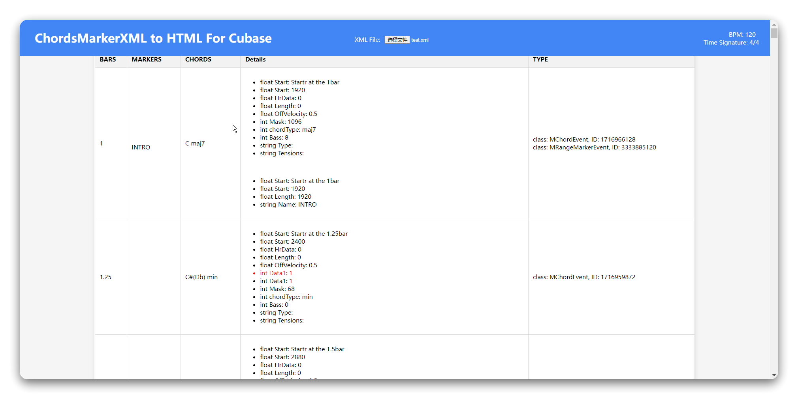
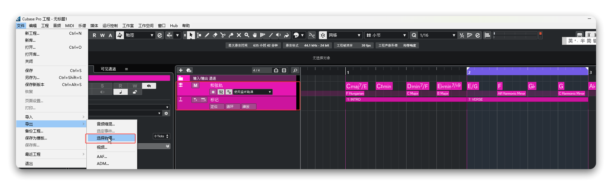

# CMxml to Table From Cubase

Analyze ChordsMarkerTracks XML to Table From Cubase.

## Features

- [x] BPM
- [x] Time Signature 
- [x] Chords  - maj, min, sus4, sus2, dim, aug
- [x] Marker 

## TODO

- [ ] Conversion of chords (such as: C/G ...)
- [ ] Rendering to tables, PDF, WORD, and other formats

### HOW

1. In your Cubase project, select the edited chord and marker tracks, then export the selected tracks. Save it to your desktop, for example, as myProjectChordsArrage.xml.

   

2. Clone the repository.

3. Run index.htm.

4. Import the XML file.

   

5. Wait for the parsing to complete.